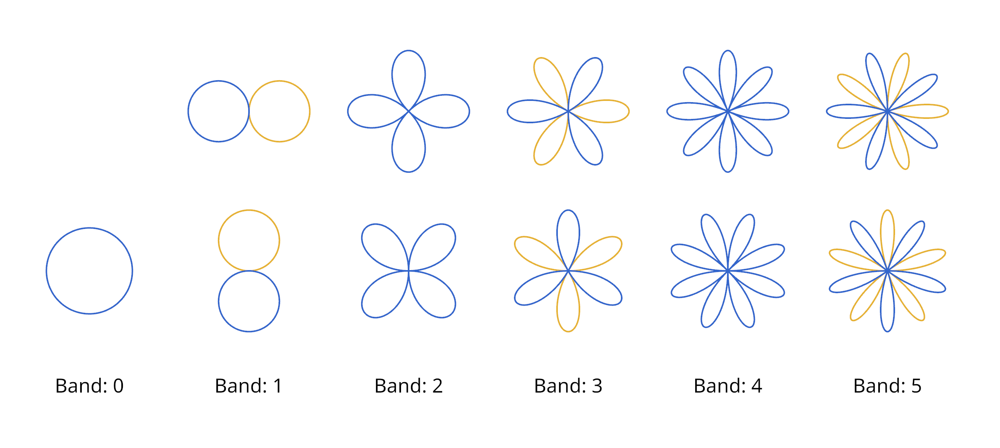
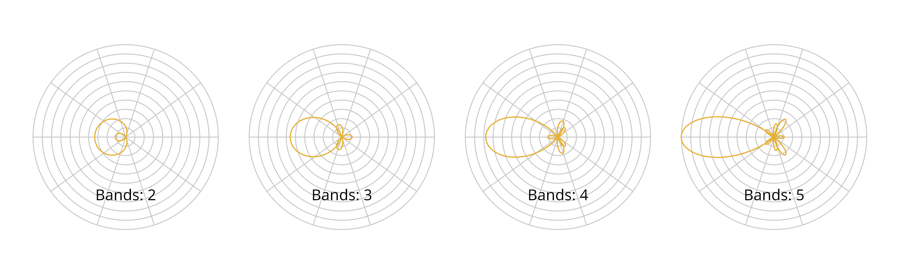

# Circular Harmonics: Digging in circles
### By Jon Valdés

Sometimes you discover a nice-looking path through the forest, and you follow
it thinking it'll lead you to some new, exciting place. But as you walk and walk
amongst the trees, you come to realize it's actually leading you somewhere you
already knew. This article is a story about (re)discovery, and how new things
can make us understand old things better.

Before we start, though, I want to make clear I'm **in no way** an "expert
mathematician". Every single piece of mathematical knowledge I've used in this
article, I was taught in high school. And I have forgotten so much of it, in
fact, that for the integrals in this article I had to resort to [Wolfram
Alpha](https://wolframalpha.com/) every single time. <nobr>¯\\\_(ツ)\_/¯</nobr>

This also means this article *is likely to have innacuracies*, and a fair share
of things an actual mathematician would consider silly. For any such things (or
anything else you want), you can reach me by email at **jon** at this domain,
or on Twitter at [jon_valdes](https://twitter.com/jon_valdes/).

## My Circular Harmonics journey
A few days ago I started investigating a bit of a mathematical curiosity. I was
working on a small project where I had functions applying forces around a
circle, and I thought "Humm, it'd be nice if I could use something like
Spherical Harmonics, but in 2D". And so I did the obvious thing: I Googled
(or, rather, I "duckduckwent") "Circular Harmonics".

And it turns out Circular Harmonics do indeed exist! Sadly, though,
references to them are quite scarce on the internet (Foreshadowing? Maybe. Keep reading ^_^ ). Thankfully, I did find
[this article by a developer named
**blackpawn**](https://blackpawn.com/texts/ch/default.html). At first I found
it a bit too dense for my feeble and woefully out of shape math-fu, so I
decided to spend a few hours unpacking it, and by the end I felt ready to
derive some more stuff on top of it.

So, let's see what I got myself into.

## But first: Spherical Harmonics

[Spherical
Harmonics (SH)](https://en.wikipedia.org/wiki/Spherical_harmonics) are a
widely-used approximation for functions on the surface of a sphere. You would
use this, for example, if you wanted to store the approximate brightness coming
at a point from every direction. And this is in fact one of the most common
uses of SH in computer graphics. See [this article by Peter-Pike Sloan](http://www.ppsloan.org/publications/StupidSH36.pdf), [this presentation by Michał Iwanicki and Peter-Pike Sloan](https://www.advances.realtimerendering.com/s2017/Precomputed%20Lighting%20in%20CoD%20IW_20_PPS.pdf), [this implementation by Don Williamson](https://github.com/dwilliamson/SHTest), [this other test app by Yuriy O'Donnell](https://github.com/kayru/Probulator), [this talk also by Yuriy O'Donnell](https://media.contentapi.ea.com/content/dam/eacom/frostbite/files/gdc2018-precomputedgiobalilluminationinfrostbite.pdf), [this series of blog posts by Graham Hazel](https://grahamhazel.com/blog/spherical-harmonics/)... As I said, widely used :) 

To encode this information, SH uses different "bands". Each band encodes
information in higher and higher frequencies, with the first band encoding a "zero frequency" function (a constant value), while the next bands store first 1 "lobe" for each term, then 2, etc. 

<video muted loop onscroll="onVideoScroll(this)" preload="auto">
  <source src="images/sh_terms.webm" type="video/webm">
  <source src="images/sh_terms.mp4" type="video/mp4">
  Your browser does not support the video tag.
</video> 

Shape of the first 5 Spherical Harmonic bands.

In this way, they work similarly to a [Taylor
series](https://en.wikipedia.org/wiki/Taylor_series) or a [Fourier
Series](https://en.wikipedia.org/wiki/Fourier_series): the more terms you add,
the more you approach the function you're approximating.

## In with the Circular Harmonics

Circular Harmonics are the 2D analog of Spherical Harmonics. That is,
instead of approximating functions on the surface of a sphere, CH
do the same, but on a circle.

Shape of the first 6 Circular Harmonic bands

To evaluate a Circular Harmonics series at a specific angle $\theta$, we have
to multiply each of its coefficients (or terms) by the corresponding CH basis
function, and add them all together:

$$\tilde{F} (\theta) = \sum_{i=0}^n w_i B_i(\theta)$$

Where $n$ is the number of terms in the series, $w_i$ are the CH terms
themselves, and $B_i$ are the CH basis functions.

That is, CH allows us to reconstruct an arbitrary function by calculating the
dot product between the coefficients vector ($w_i$) and the vector of circular
harmonic basis functions ($B_i$), evaluated at the point we want to reconstruct ($\theta$).

The basis functions $B_0, B_1, B_2 \ldots$ in CH follow a simple pattern:
  $$
  \frac{1}{\sqrt{2\pi} },
  \frac{cos(\theta)}{\sqrt{\pi} },
  \frac{sin(\theta)}{\sqrt{\pi} },
  \frac{cos(2\theta)}{\sqrt{\pi} },
  \frac{sin(2\theta)}{\sqrt{\pi} },
  \frac{cos(3\theta)}{\sqrt{\pi} },
  \frac{sin(3\theta)}{\sqrt{\pi} },
  \ldots$$

As **blackpawn** mentions in their article, to generate the set of harmonic
coefficients $w_i$ needed to approximate a given function, we have to project
the function onto each of the circular harmonic basis functions: 

$$w_i = \int_0^{2\pi} F(\theta) B_i(\theta)\ d\theta$$

Where $F$ is the function we're trying to approximate, and $B_i$ is the
$i^{th}$ circular harmonic basis function.

## Projecting an infinitesimal pulse

As a warm-up exercise for my rusty math skills, I decided to derive the
projection onto CH of a point signal (that is, the entire signal is coming from
only one direction $\theta$).

To represent our zero-width pulse, we can use the 
[Dirac Delta function](https://en.wikipedia.org/wiki/Dirac_delta_function), as
it is 0 everywhere except in one point, which we can make coincide with the 
$\theta$ direction our signal is coming from. This function turns our
entire integral into a single point (everything else is multiplied by zero), so
the integral disappears, turning each CH coefficient into the $i_th$ basis
function itself, evaluated at $\theta$.

$$w_i = \int_0^{2\pi} \delta(\theta) B_i(\theta)\ d\theta =  B_i(\theta)$$

A series of CH approximating a pulse with more and more bands

This does work, but the approximation is not particularly good. You can see how
the function over/undershoots in other directions, as the CH representation
tries to make sense of this function. Normally, adding more bands to the CH would 
help, but this function is too problematic to represent (infinite frequency signal 
represented with finite terms? Good luck with that!)

## Projecting a box function

After the punctual pulse, I decided to try to tackle box functions. They still have 
infinite frequency on the edges of the function, but hopefully that's not so much of 
a problem with the rest of the function being smooth.

For this, a common trick to simplify our lives is to consider it a function that
is 1 for the width of the pulse, and then becomes zero. Essentially, a "step
down" function. We could then rotate the resulting CH to face whatever direction
we want, and we'd have all we need.

Looking at the integral to compute our $w_i$ terms:
$$w_i = \int_0^{2\pi} F(\theta) B_i(\theta)\ d\theta$$

And if we have a "box" function with a pulse width of $p_w$

$$F(\theta) =
\begin{cases}
	1\, & 0 \leq \theta \leq p_w \\\\
	0\, & \text{otherwise}
\end{cases}
$$

We can see how the integral gets simplified to $\int B_i(\theta)\ d\theta$ for the area where $F(\theta) = 1$, and how it disappears where $F(\theta) = 0$. We can do this by changing the interval to $[0,p_w]$:
$$w_i = \int_0^{p_w} B_i(\theta)\ d\theta$$

To compute the value of $w_i$ we'll just need to evaluate the definite integral at the lower and upper limits of the integral:
$$S_i(\theta) = \int B_i(\theta)\ d\theta$$
$$w_i = S_i(\theta) - S_i(0)$$

Also, thankfully, the integrals of the $B_i$ terms are very simple:

$$\frac{\theta}{\sqrt{2\pi} }, \frac{sin(\theta)}{\sqrt{\pi} },  \frac{-cos(\theta)}{\sqrt{\pi} }, \frac{sin(2\theta)}{2\sqrt{\pi} }, \frac{-cos(2\theta)}{2\sqrt{\pi} }, \frac{sin(3\theta)}{3\sqrt{\pi} },\frac{-cos(3\theta)}{3\sqrt{\pi} }, \ldots$$
 
<video muted loop onscroll="onVideoScroll(this)" preload="auto">
  <source src="images/ch_box.webm" type="video/webm">
  <source src="images/ch_box.mp4" type="video/mp4">
  Your browser does not support the video tag.
</video> 

Circular Harmonic series for box functions of different widths $\theta$, approximated using different band counts

This is actually not bad! There's some over/undershooting still (hey, we're trying to approximate an infinite-frequency function with just a few terms, after all), but it's actually getting quite close to the original function when you add a bunch of terms.

## Rotating CH

Another thing I needed was the ability to arbitrarily rotate an SH. Thinking a bit about this, we can see the band $\beta_1$ terms look just like the equation for a circle of $\frac{1}{\sqrt\pi}$ radius

$$
  \frac{cos(\theta)}{\sqrt{\pi} },
  \frac{sin(\theta)}{\sqrt{\pi} }
$$

So we can consider the pairs of terms in each band as the horizontal and vertical components of the signal reconstruction. This only really works for band $\beta_1$, though. For the next bands, however, if we look closely we'll see they're all rotationally symmetric, and each band has one more symmetry than the last. We can think of this as the function repeating $N$ times per revolution. And so, if we multiply our $\varphi$ rotation angle by $N$, we can turn a rotation angle of $\varphi = \frac{2\pi}{N}$ into a full $2\pi$ revolution.

<video muted loop onscroll="onVideoScroll(this)" preload="auto">
  <source src="images/ch_rot_scale.webm" type="video/webm">
  <source src="images/ch_rot_scale.mp4" type="video/mp4">
  Your browser does not support the video tag.
</video> 

Scaling CH terms until they match band $\beta_1$

In this way, to rotate a CH, we can get the two coefficients for each band, treat them as a 2D vector, rotate it as you normally would, and extract the new horizontal and vertical components to get the rotated CH's coefficients.

	for band in [1..band_count]:
		// Compensate for changing rotational symmetry
		band_rot_angle = angle * band.index
    	// Rotate vector
    	new_x = band.x * cos(band_rot_angle) - band.y * sin(band_rot_angle)
    	new_y = band.y * cos(band_rot_angle) + band.x * sin(band_rot_angle)
		set_band(band.index, new_x, new_y)

Band $\beta_0$ defines a constant, isotropic value, so rotation does nothing to it.

<video muted loop onscroll="onVideoScroll(this)" preload="auto">
  <source src="images/ch_rot.webm" type="video/webm">
  <source src="images/ch_rot.mp4" type="video/mp4">
  Your browser does not support the video tag.
</video> 

CH for a box function of different $\theta$ widths, rotating around the circle

## CH Composition

Thankfully, adding Circular Harmonics together is extremely easy. One just needs to add all their terms together, and that's it.

<video muted loop onscroll="onVideoScroll(this)" preload="auto">
  <source src="images/ch_composition.webm" type="video/webm">
  <source src="images/ch_composition.mp4" type="video/mp4">
  Your browser does not support the video tag.
</video> 

Adding two Circular Harmonics together

Similarly, subtracting a CH from another is just a matter of subtracting their terms.

<video muted loop onscroll="onVideoScroll(this)" preload="auto">
  <source src="images/ch_composition_sub.webm" type="video/webm">
  <source src="images/ch_composition_sub.mp4" type="video/mp4">
  Your browser does not support the video tag.
</video> 

Subtracting one Circular Harmonics from another

## Ringing
When dealing with Spherical Harmonics, it's typical to run into "ringing artifacts". These are cases where the reconstructed function becomes negative in some areas because that's the way to achieve an overall minimum error with an SH representation of a function. When dealing with lighting information encoded as SH, this results in _negative lights_, which is a very big no-no in rendering.

In Circular Harmonics we seem to have a similar problem. We encoded a pulse and a box function as CH, but far from getting a clean approximation to those functions when we evaluate the CH, we're getting a ton of over- and under-shooting around the function.

When dealing with a Fourier series, this is generally called "Gibbs Phenomenon". Peter-Pike Sloan describes it like this in his "[Stupid SH Tricks](http://www.ppsloan.org/publications/StupidSH36.pdf)" article:

> Ringing, also called Gibbs Phenomenon, is a common problem in signal processing.  When a 
> signal with a discontinuity is projected into a finite Fourier basis (which can only represent 
> continuous functions) overshoot and undershoot will happen around the discontinuity. 

*In fact, if we squint a bit, it kinda looks like the approximation errors you get when trying to approximate a function using Fourier series, right?*

## Massive facepalm moment

Yep, I entirely missed the fact that one of the first things **blackpawn**'s article says is:

> The circular harmonic basis functions are given by **the Fourier series** [...]

So, yes, I didn't realize I was working with a Fourier series this whole time. Cue in the Picard facepalm meme here.

On the flip side, things make a lot more sense now! Let's see what we can make out of this revelation.

## Circular Harmonics are a Fourier Series
The sine-cosine form of the Fourier series is defined as:

$$S_N(x) = \frac{a_0}{2} + \sum_{n=1}^N\left(a_n\cos\left(\frac{2\pi}{P}nx\right)+b_n\sin\left(\frac{2\pi}{P}nx\right)\right)$$

$P$ is the length of the interval in which we're applying the transform. In our case we're working on a circle, so it'll be $P=2\pi$. This leaves us with:

$$S_N(x) = \frac{a_0}{2} + \sum_{n=1}^N\left(a_n\cos\left(nx\right)+b_n\sin\left(nx\right)\right)$$

If we look again at our CH basis functions
  $$
  \frac{1}{\sqrt{2\pi} },
  \frac{cos(\theta)}{\sqrt{\pi} },
  \frac{sin(\theta)}{\sqrt{\pi} },
  \frac{cos(2\theta)}{\sqrt{\pi} },
  \frac{sin(2\theta)}{\sqrt{\pi} },
  \frac{cos(3\theta)}{\sqrt{\pi} },
  \frac{sin(3\theta)}{\sqrt{\pi} },
  \ldots$$

And the equation to evaluate the CH
$$\tilde{f} (\theta) = \sum_{i=0}^n w_i B_i(\theta)$$

We can see how the sum expands to exactly the same thing as the sine-cosine form of the Fourier series above, except for a constant factor of $1/\sqrt\pi$ in our CH form.

And so, indeed, **Circular Harmonics are just a Fourier series with $\bf{P=2\pi}$ and scaled by $\bf{1/\sqrt\pi}$**

If we transform our CH from polar to rect coordinates, we see it looks exactly like a Fourier series:

<video muted loop onscroll="onVideoScroll(this)" style="width:60%" preload="auto">
  <source src="images/ch_fourier_both.webm" type="video/webm">
  <source src="images/ch_fourier_both.mp4" type="video/mp4">
  Your browser does not support the video tag.
</video> 

Pulse and box function CHs being unwrapped to lat-long coordinates, showing the familiar FFT shape

This is, of course, *entirely obvious* in retrospect. A Fourier series is supposed to represent a periodic function, but what is a periodic function other than a function around a circle with the same perimeter as the function's period?

It is, however, an explanation of Fourier series I hadn't come across before, and I find it illuminating.

This explains why the Fourier series is formed by a series of sines and cosines: they define a function on a circle, with the sine parts representing the vertical component, and the cosine parts the horizontal one.

It finally makes sense! (to me, at least)

## Conclusion

So, Circular Harmonics do exist, and they look useful... even if they're nothing more than a Fourier series on the unit circle. 

Still, this served me to get a better understanding of how Fourier series work, and add a new tool to my toolbox!

I hope you enjoyed the ride, and got something useful out of this :)

## Resources

The code used to rendered all the images and animations in this article, as well as the source for the article itself, is available at [https://github.com/jonvaldes/circular_harmonics_article/](https://github.com/jonvaldes/circular_harmonics_article/)

## Acknowledgements

Animations and images made using the [Nannou](https://nannou.cc/) library.

Thanks to [fmonkey](https://twitter.com/fmonkey) and [txusinho](https://twitter.com/txusinho) for reviewing early drafts of this article.

  
--- 

<cc>  This work is licensed under a <a rel="license" href="http://creativecommons.org/licenses/by-sa/4.0/">Creative Commons Attribution-ShareAlike 4.0 International License</a>.
</cc>
